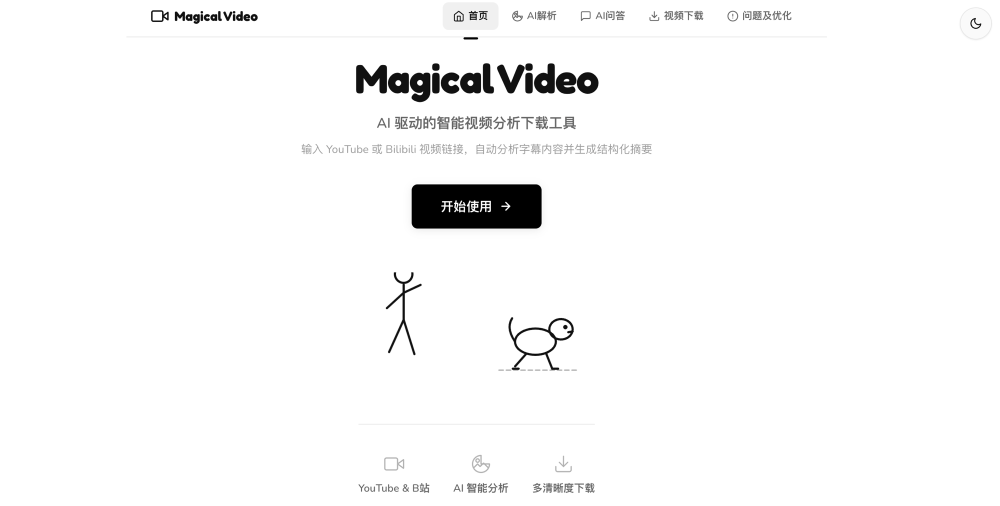

[English](README.md) | [中文](README_CN.md)

# 🎬 Magical Video

Magical Video 是一个基于 AI 的视频内容分析工具。输入 YouTube 或 Bilibili 视频链接，程序自动提取字幕，交由 DeepSeek 进行结构化分析，最终输出包含概述、大纲、要点、总结和交互式思维导图的多维度摘要。分析完成后，可以就视频内容与 AI 对话问答，所有回答都基于字幕原文。同时支持视频下载。

核心价值在于 AI 分析流程：一段 30 分钟的视频，可以在不到一分钟内浏览其结构化拆解结果（概述、大纲、关键要点、结论及知识树思维导图），还可通过 AI 问答针对特定话题深入追问。

[](https://www.python.org/)
[](https://fastapi.tiangolo.com/)
[](https://vuejs.org/)
[](https://vitejs.dev/)
[](LICENSE)



---

## 🧠 核心功能：AI 视频分析

主流程接收视频链接，输出四维度分析结果及交互式思维导图：

1. **解析**：yt-dlp 获取视频元数据（标题、时长、封面）。
2. **提取字幕**：YouTube 通过 `youtube-transcript-api` 获取字幕；Bilibili 通过 yt-dlp 下载字幕文件后解析 VTT 或 JSON 格式。
3. **AI 分析**：字幕文本发送至 DeepSeek（`deepseek-v4-flash` 模型），系统提示词要求输出详实、有原文依据的结构化结果。分析进度通过 SSE 实时推送到前端。
4. **结果展示**：选项卡式界面呈现概述、大纲、要点、结论四个维度，并包含基于 markmap 的交互式思维导图。

系统提示词要求模型保留原文中的术语、数字、案例名称和直接引用，避免过度概括。思维导图要求至少 30 个节点，覆盖 4 层深度。

---

## 💬 核心功能：AI 问答

AI 分析完成后，可以就视频内容向 AI 提问，获取基于字幕原文的回答：

1. **上下文加载**：问答页面自动加载最近的分析结果，在可折叠侧边栏中展示完整的内容大纲（概述、大纲、要点、总结）。
2. **自由提问**：输入任何关于视频的问题 — 后端将字幕文本和分析摘要发送给 DeepSeek，系统提示词要求回答必须引用原文证据。
3. **聊天界面**：简洁的对话式 UI，气泡消息、原文引用 blockquote 样式、AI 思考时的打字动画。

问答系统提示词要求 AI 严格基于字幕内容回答，用「」标注原文引用，视频未涉及的内容如实告知。

---

## 📥 辅助功能：视频下载

输入链接后可直接下载视频，支持选择可用的分辨率和格式。后端通过 yt-dlp 下载完成后将文件流式传输至浏览器。

**当前限制**：YouTube 下载因使用 Android 客户端绕过 SABR 风控，最高仅支持 360p（详见已知问题）。

---

## 🛠 技术栈

| 组件 | 技术 |
|------|------|
| 后端框架 | FastAPI (Python) |
| 下载引擎 | yt-dlp |
| AI 服务 | DeepSeek API (v4-flash) |
| YouTube 字幕 | youtube-transcript-api |
| 前端框架 | Vue 3 (Composition API, SFC) |
| 构建工具 | Vite |
| 路由 | vue-router (hash 模式) |
| 思维导图 | markmap (基于 d3) |
| 实时通信 | Server-Sent Events (SSE) |

---

## 📁 项目结构

```
Magical-Video/
├── backend/
│   ├── main.py                   # FastAPI 入口
│   ├── config.py                 # 环境变量配置
│   ├── requirements.txt
│   ├── .env.example              # 环境变量模板
│   ├── models/schemas.py         # Pydantic 数据模型
│   ├── routers/
│   │   ├── analyze.py            # /api/parse, /api/analyze-stream, /api/thumbnail
│   │   ├── download.py           # /api/download
│   │   └── qa.py                 # /api/ask — AI 问答
│   └── services/
│       ├── ytdlp_service.py      # yt-dlp 子进程封装
│       ├── subtitle_service.py   # 字幕提取与解析
│       └── deepseek_service.py   # DeepSeek API 客户端
│
└── frontend/
    ├── src/
    │   ├── App.vue               # 布局壳（主题切换、导航栏、路由视图）
    │   ├── main.js               # Vue 启动入口
    │   ├── api/index.js          # HTTP 请求封装
    │   ├── router/index.js       # 路由配置（hash 模式）
    │   ├── styles/main.css       # 全局样式（灰度主题、CSS 变量）
    │   ├── components/           # 公共组件
    │   │   ├── NavBar.vue
    │   │   ├── VideoInfo.vue
    │   │   ├── CookieGuide.vue
    │   │   ├── AnalysisResult.vue
    │   │   ├── DownloadSection.vue
    │   │   ├── MindMap.vue
    │   │   ├── SubtitleViewer.vue
    │   │   └── StickFigures.vue
    │   └── views/                # 页面级组件
    │       ├── HomePage.vue
    │       ├── AnalysisPage.vue
    │       ├── QAPage.vue
    │       ├── DownloadPage.vue
    │       └── IssuesPage.vue
    ├── index.html
    ├── package.json
    └── vite.config.js
```

---

## 🚀 环境搭建

### 前置条件

- Python 3.10 及以上
- Node.js 18 及以上
- ffmpeg（推荐安装；yt-dlp 合并视频和音频时需要）
- DeepSeek API 密钥（[platform.deepseek.com](https://platform.deepseek.com/)）
- yt-dlp（通过 pip 自动安装）

### 后端

```bash
cd backend
python3 -m venv venv
source venv/bin/activate          # Windows: venv\Scripts\activate
pip install -r requirements.txt
cp .env.example .env              # 编辑填入 DEEPSEEK_API_KEY
uvicorn main:app --reload --port 8000
```

API 服务启动在 `http://localhost:8000`。FastAPI 内置的 Swagger 接口文档可通过浏览器访问 `http://localhost:8000/docs`，在此可以浏览和测试所有 API 接口。

### 前端

```bash
cd frontend
npm install
npm run dev                       # 开发服务器 http://localhost:5173
```

Vite 开发服务器自动将 `/api` 请求代理到后端 `localhost:8000`。

### 生产构建

```bash
cd frontend && npm run build      # 输出到 frontend/dist/
```

将 `frontend/dist/` 部署到任意静态文件服务器，并将 `/api/*` 请求代理到 FastAPI 后端。

---

## 📖 使用指南

### AI 分析

1. 浏览器打开 `http://localhost:5173`。
2. 点击导航栏中的"AI解析"。
3. 在输入框中粘贴 YouTube 或 Bilibili 视频链接。
4. Bilibili 链接需要先展开"B站 Cookies"面板，粘贴浏览器 Cookie 并点击"保存 Cookies"。（YouTube 链接跳过此步骤。）
5. 点击"解析视频"，等待视频信息（标题、时长、封面）加载。
6. 点击"AI 分析"，后端会自动提取字幕并发送给 DeepSeek 进行分析，进度实时显示。
7. 分析完成后，在四个选项卡中浏览结果：概述、大纲、要点、总结。"思维导图"选项卡提供交互式知识树。

### AI 问答

1. 在"AI解析"页面完成分析后，点击导航栏中的"AI问答"。
2. 在左侧边栏浏览内容大纲，点击标题可展开/折叠详情。
3. 在底部的输入框中输入问题，按 Enter 发送。
4. AI 将基于视频字幕内容回答，尽可能引用原文。

### 快速下载

1. 点击导航栏中的"视频下载"。
2. 粘贴视频链接，点击"解析视频"。
3. 在清晰度网格中选择需要的分辨率。
4. 点击"下载视频"，浏览器将弹出保存对话框。

### 获取 Bilibili Cookies

Bilibili 需要登录 Cookie 才能获取视频信息，获取方法：

1. 在浏览器中登录 [bilibili.com](https://www.bilibili.com)。
2. 安装浏览器扩展，如"Get cookies.txt LOCALLY"（Chrome/Edge）或"cookies.txt"（Firefox）。
3. 打开任意 Bilibili 视频页面，点击扩展图标，导出 Netscape 格式的 Cookie。
4. 将导出的文本粘贴到应用中的"B站 Cookies"面板。

Cookie 会经过校验，确保包含 `DedeUserID`、`SESSDATA`、`bili_jct` 三个必填字段。Cookie 写入临时文件传递给 yt-dlp，请求完成后立即删除。

---

## 🔧 技术挑战与解决方案

**Bilibili 412/403 反爬拦截**。Bilibili 对无有效登录凭证的请求返回 412 或 403。通过实现 Netscape 格式 Cookie 解析解决：用户粘贴浏览器 Cookie，后端校验必填字段（`DedeUserID`、`SESSDATA`、`bili_jct`），写入临时文件传给 yt-dlp，用完即删。

**YouTube SABR 流式拦截**。YouTube 的服务端与浏览器协同渲染机制拦截默认 Web 客户端的流媒体请求。通过切换到 Android 客户端（`youtube:player_client=android`）绕过。代价是无 PO Token 时仅能获取 360p 格式。

**Bilibili 字幕提取失败**。`yt-dlp --write-subs` 对 Bilibili 不产生字幕文件，`dump-json` 也不包含字幕 URL，导致 AI 分析管线中断。改为通过 yt-dlp 直接下载 VTT 文件再用 Python 解析，同时返回纯文本（供 AI 使用）和带时间戳的片段（供前端展示）。

**AI 分析质量问题**。早期提示词导致 AI 输出过于概括，丢失关键信息。重写系统提示词，强制要求四维度结构化输出，必须引用原文证据，保留术语和数字，思维导图至少 30 个节点。

**长视频 AI 超时**。超过 30 分钟的视频字幕可能超过 8000 字符，导致 30 秒超时。将字符上限提升到 25000，max tokens 提升到 10000，截断策略改为首 20% 加中 60% 加尾 20%，保证覆盖视频全程。

**Cookie 校验不准确**。早期校验仅检查行数，不完整 Cookie 也能通过。增加必填字段检测（`DedeUserID`、`SESSDATA`、`bili_jct`），缺失时给出明确错误提示。

**Emoji 跨平台渲染不一致**。Windows、macOS、Linux 对 Emoji 渲染差异大。全部替换为 Feather 风格 SVG 内联图标，使用 `currentColor` 跟随文字颜色，消除跨平台差异。

**前端巨石架构重构**。初始版本所有功能集中在单个 400 行的 `App.vue` 中。引入 vue-router（hash 模式），拆分为四个页面组件，`App.vue` 缩减为布局壳。

---

## ⚠️ 已知问题

**YouTube 分辨率限制在 360p**。Android 客户端虽然能绕过 SABR，但缺少 PO Token 无法获取 720p 及以上格式。

**Bilibili 付费内容**。1080p+ 和付费视频需要大会员 Cookie，免费用户只能下载较低画质。

**不支持批量和播放列表**。仅接受单个视频链接，播放列表链接不会被展开为单个视频。

**无下载历史记录**。没有本地或服务端的历史记录，重复分析会浪费 AI 配额。

**流式下载稳定性**。yt-dlp 子进程到 StreamingResponse 的管道在网络不稳定时可能中断，大文件尤其容易出问题。

**分析选项固定**。用户无法自定义 AI 分析侧重点（例如只提取技术细节或只输出结论）。

---

## 📝 环境变量

| 变量 | 是否必填 | 说明 |
|------|----------|------|
| `DEEPSEEK_API_KEY` | 是 | DeepSeek API 密钥 |
| `YTDLP_PROXY` | 否 | 访问 YouTube 的 HTTP 代理地址 |

复制 `backend/.env.example` 为 `backend/.env` 并填入对应值。

---

## 📄 许可证

MIT 协议。详见 [LICENSE](LICENSE)。
